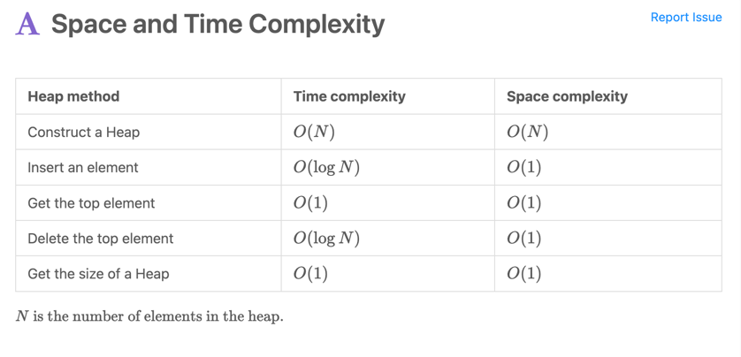

# Leetcode_Java
## 1. char[]  -> String:
char[] tmp = s.toCharArray();

String str = tmp.toString(); 

String str =  String.valueOf(tmp);

没有多大的区别，但是建议用第二个（题目：49）

## 2. List -> int[]
List<int[] > result = new ArrayList<>();

return result.toArray(new int[result.size()][]);

## 3. sort
### Array sort

```
int[][] intervals= [[1,3],[8,10],[15,18], [0,9]]
Arrays.sort(intervals, (a, b) -> Integer.compare(a[0], b[0]));

// B = A as Integer[], sorted by absolute value
Integer[] B = new Integer[A.length];
for (int i = 0; i < A.length; ++i)
    B[i] = A[i];
Arrays.sort(B, Comparator.comparingInt(Math::abs));
```

###Linkedlist sort
LinkedList<int[] > tmp = new LinkedList<>();

Collections.sort(res, new Comparator<int[]>(){
public int compare(int[] a , int[] b){
return a[0]-b[0];
}
});

## 4. Stream map
``````aidl
public class Main {
    public static void main(String[] args) {
    List.of("  Apple ", " pear ", " ORANGE", " BaNaNa ")
    .stream()
    .map(String::trim) // 去空格
    .map(String::toLowerCase) // 变小写
    .forEach(System.out::println); // 打印
    }
}
``````

## 5. Hashcode override hascode and equals
### 只用比较Hashset 的值
```aidl
Question(1293)
static class  Cell
    {
        int x;
        int y;
        int obs;

        public  Cell(int x, int y ,int obs)
        {
            this.x = x;
            this.y = y;
            this.obs = obs;
        }

        @Override
        public boolean equals(Object o) {
            if (this == o) return true;
            if (o == null || getClass() != o.getClass()) return false;
            Cell cell = (Cell) o;
            return x == cell.x && y == cell.y && obs == cell.obs;
        }

        @Override
        public int hashCode() {
            return Objects.hash(x, y, obs);
        }

        //for print
        @Override
        public String toString() {
            return "Cell{" +
                    "x=" + x +
                    ", y=" + y +
                    ", obs=" + obs +
                    '}';
        }

    }


    public static void main(String[] args) {

        HashSet<Cell> hashSet = new HashSet<>();

        Cell cell1 = new Cell(0,0,0);
        Cell cell2 = new Cell(0,0,0);

        hashSet.add(cell1);

        System.out.println(hashSet.contains(cell2));
    }
```

##6 PriorityQueue的用法
###
1.Construct a Max Heap and a Min Heap. 
Time complexity: O(N). Space : O(N).

2.Insert elements into a Heap.O(logN) O(1)

3.Get the top element of a Heap.O(1) O(1)

4.Delete the top element from a Heap. O(logN) O(1)

5. Get the length of a Heap.

###
```aidl
PriorityQueue<int[]> priorityQueue = new PriorityQueue<>((a, b)-> (a[0]*a[0] + a[1]* a[1]) - (b[0]*b[0] + b[1]* b[1]));


// Construct an empty Min Heap
PriorityQueue<Integer> minHeap = new PriorityQueue<>();

// Construct an empty Max Heap
PriorityQueue<Integer> maxHeap = new PriorityQueue<>(Collections.reverseOrder());

// Construct a Heap with initial elements. 
// This process is named "Heapify".
// The Heap is a Min Heap
PriorityQueue<Integer> heapWithValues= new PriorityQueue<>(Arrays.asList(3, 1, 2));
```
